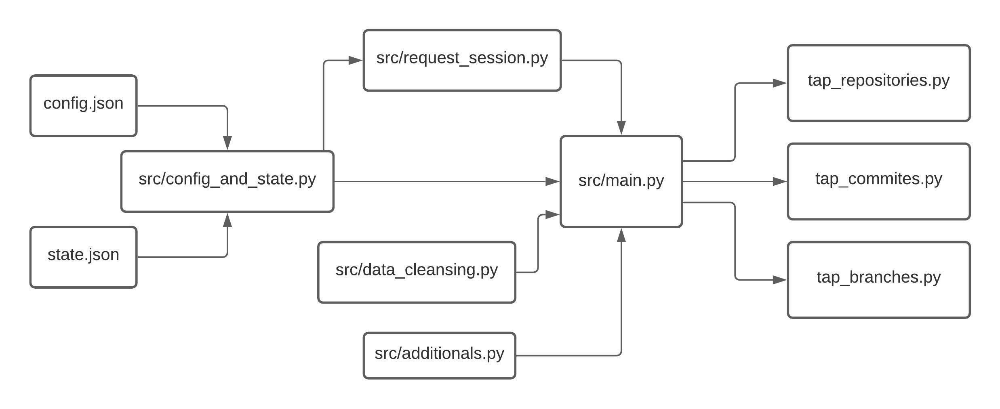

# extracting-using-singer-spec

## Usage
---

Some arguments are **required** to run a tap file:

| Param | Description |
| --- | --- |
| `-c` or `--config` | to access items needed in `config.json` |
| `-s` or `--state` | to access items needed in `state.json` |

To run a tap file:

`$ pipenv run python <tap-file-name> -c config.json -s state.json`

Make sure you have set the `username` *(github username)* and the `access_token` *([github access token](https://docs.github.com/en/github/authenticating-to-github/keeping-your-account-and-data-secure/creating-a-personal-access-token))* in `config.json` file

## How To Develop a Tap *(github tap in this case)*
---

## 1. Pipenv

> [Pipenv](https://docs.python-guide.org/dev/virtualenvs/) is a new community standard application that combines pip & virtual env, and extends their functionality in a single app.

To install pipenv:

`$ pip3 install --user pipenv`

## 2. Singer-Python

> [Singer.io](https://github.com/singer-io) is an open source standard for moving data between databases, web APIs, files, queues, etc. The Singer spec describes how data extraction scripts called **Taps** and data loading scripts called **Targets** should communicate using a standard JSON-based data format over stdout.

Can using [singer-python](https://github.com/singer-io/getting-started/blob/master/docs/RUNNING_AND_DEVELOPING.md#a-python-tap) library to run singer using Python.

To install **singer-python**:

`$ pipenv install singer-python`

## 3. Create Scripts

Detail about every script files:

| Files | Description | Reference |
| --- | --- | --- |
| `src/main.py` | Is the main file, contain functions to set the URL endpoint and URL params (*other than **access_token** & **username***), then loop thru the whole pages to fetch data. All functions in other files will be called here |  |
| `src/request_session.py` | Set the `requests.session` to make the API call faster. Also set the **access_token** and **username** params here | [python request session](https://2.python-requests.org/en/master/api/#request-sessions) |
| `src/config_and_state.py` | Contain functions to access items in config.json & state.json | |
| `src/data_cleansing.py` | Contain functions to clean data, e.g. select desired attributes, rename attribute, handle null values, flatten nested dictionary | |
| `src/additionals.py` | Contain additional functions | |
| `tap_repositories.py` | Produce **repository logs** data streams | |
| `tap_commits.py` | Produce **commit logs** data streams | |
| `tap_branches.py` | Produce **branches** data streams | |
| `config.json` | Contain configuration items needed to run tap, e.g. `access_token`, `username`, etc | [singer config file docs](https://github.com/singer-io/getting-started/blob/master/docs/CONFIG_AND_STATE.md#config-file) |
| `state.json` | Contain **latest updated date** of extracted data to perform **upsert** process | [singer state file docs](https://github.com/singer-io/getting-started/blob/master/docs/CONFIG_AND_STATE.md#state-file) |

This is the script flow looks like:

## 4. Detail about `config.json` & `state.json`

Detail about items in `config.json` file:

| Item | Description | Is Required? | Reference |
| --- | --- | --- | --- |
| `base_api_url` | Is the base API url from github | **true** | [getting started with github rest API](https://docs.github.com/en/rest/guides/getting-started-with-the-rest-api) |
| `username` | Github username | **true** | |
| `access_token` | A token that is used in place of a password when performing Git operations over HTTPS with Git on the command line or the API | **true** | [create personal access token](https://docs.github.com/en/github/authenticating-to-github/keeping-your-account-and-data-secure/creating-a-personal-access-token) |
| `is_initial_extraction` | **true** to fetch data from the very beginning of time, **false** to continue fetch from the latest date | **true** | |

Detail about items in `state.json` file:

| Item | Description | Is Required? | Reference |
| --- | --- | --- | --- |
| `last_updated_staging` | Last updated date per data stream, that will continuously updated **while** the tap is running | **true** | |
| `last_updated_final` | Last updated date per data stream, that will be updated **after** the tap stop running | **true** | |

#### How `state.json` works:

`check_initial_extraction()` function in `main.py` file will check the value of `is_initial_extraction` in `config.json`. There are 2 scenarios:
* If `is_initial_extraction` set to **true**:
Will **ignore** `state.json` file (fetch data from the very beginning of the time)

* If `is_initial_extraction` set to **false**:
    1. `check_initial_extraction()` func returns ***last_updated_final*** item from `state.json` and put it into `since` URL parameter, this will make tap to fetch data **start from that date**.
    2. For every data fetched, call `update_staging_state_file()` func to compare if ***updated date*** in data > ***last_updated_staging***. If yes, then update ***last_updated_staging*** item in `state.json`. This happen while the tap running.
    3. After the tap stop running, copy the ***last_updated_staging*** + 1 second to ***last_updated_final*** item in `state.json`. The + 1 second is additional condition just to make sure the last fetched data only fetched 1 time.

## 5. Data Streams

| Stream Name | Description | Can Perform Upsert Process? | Required Params | Reference |
| --- | --- | --- | --- | --- |
| `repository logs` | return list of repository logs for a user | **true** | `username` | [list repositories for a user API docs](https://docs.github.com/en/rest/reference/repos#list-repositories-for-a-user) |
| `commit logs` | return list of commit logs for a repository | **true** | `username`, `repository name` | [list commits API docs](https://docs.github.com/en/rest/reference/repos#list-commits) |
| `branches` | return list of branches for a repository | **false** | `username`, `repository name` | [list branches API docs](https://docs.github.com/en/rest/reference/repos#list-branches)

For data stream that can perform upsert process, must store **last_updated_staging** & **last_updated_final** attribute in `state.json` file.